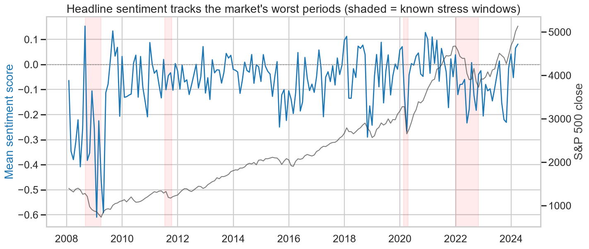
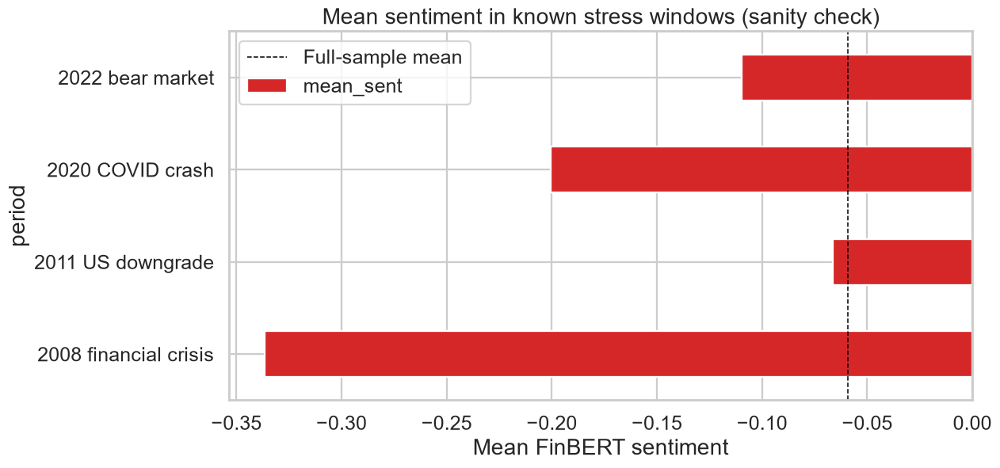
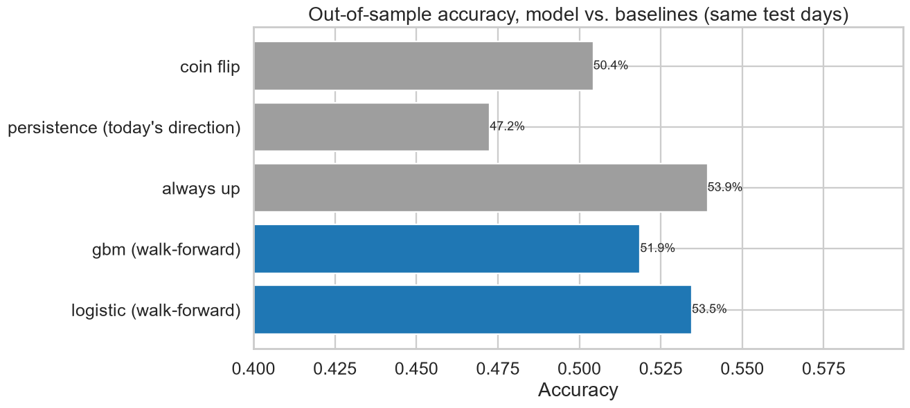
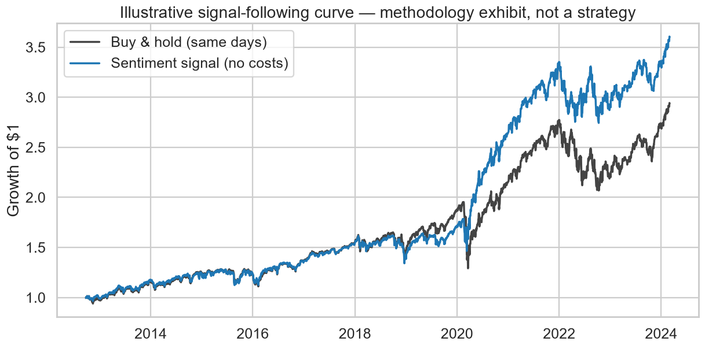

# Financial News Sentiment and Next-Day Market Movement
### What 16 years of headlines can — and cannot — tell you about the S&P 500

*Research analysis, 2008–2024 · 18,153 headlines · 3,507 trading days*

---

## Slide 1 — The question we actually tested

**Is there a measurable relationship between the sentiment of financial news
headlines and the S&P 500's movement the next trading day?**

This is a real, well-studied question in empirical finance — the event-driven
sentiment literature (Tetlock 2007's Wall Street Journal column study is the
classic reference) — not a stock-picking pitch. The interesting part is not
"can we get rich" (we can't, and the analysis shows why); it's whether news
text carries any incremental information about near-term index moves at all,
and how easily sloppy methodology can manufacture the illusion that it does.

**What this is not:** a trading system, a price predictor, or investment
advice. Every design choice below exists to keep the answer honest rather
than impressive.

---

## Slide 2 — Key finding: a weak, borderline signal that a model cannot exploit

| Relationship | Correlation (r) | Significance |
| --- | --- | --- |
| Same-day: sentiment(t) vs return(t) | **0.18** | p < 0.0001 |
| **Next-day: sentiment(t) vs return(t+1)** | **0.03** | HAC p = 0.052 |

- The **same-day** association is strong — but it is mostly the news *reporting*
  the move, not predicting it. Headlines like "Stocks Plunge As…" are written
  after the close. We treat this as a scorer sanity check, never as skill.
- The **next-day** association — the honest question — is an order of magnitude
  weaker and sits exactly on the boundary of statistical significance.
- It is directionally consistent: after the most-positive-sentiment days, the
  next day is up **56.8%** of the time; after the most-negative, **51.8%**
  (χ² p = 0.050). Real-looking, modest, and fragile.

---

## Slide 3 — Where the signal is stronger, weaker, and absent

| Subsample | Next-day correlation | p-value |
| --- | --- | --- |
| High-volatility periods | 0.042 | 0.10 |
| Low-news-volume days | 0.041 | 0.07 |
| Low-volatility periods | 0.016 | 0.52 |
| High-news-volume days | 0.017 | 0.54 |

- What little tilt exists concentrates in **turbulent markets**, consistent
  with the academic finding that sentiment matters most when attention and
  fear are elevated. In calm markets it is indistinguishable from zero.
- The sentiment scorer itself passes its sanity checks convincingly: mean
  headline sentiment in the 2008 crisis was **−0.34** vs **−0.06** overall,
  and **−0.20** during the 2020 COVID crash.

---

## Slide 4 — The model: honest baselines, honest result

Walk-forward logistic regression predicting next-day direction from
leakage-audited sentiment + price features:

| Model | Out-of-sample accuracy | AUC |
| --- | --- | --- |
| **Always predict "up"** (naive baseline) | **53.9%** | 0.500 |
| Logistic regression (sentiment + price) | 53.5% | 0.500 |
| Gradient boosting | 51.9% | 0.500 |
| Coin flip | 50.4% | — |

- The S&P 500 drifts upward, so "always up" is right on most days.
  **50% was never the bar — 53.9% was, and the model does not clear it**
  (McNemar p = 0.45; the boosted model is significantly *worse*).
- AUC ≈ 0.50 means zero ranking skill: the borderline correlation on Slide 2
  is too weak and unstable to exploit out of sample once leakage is removed.

---

## Slide 5 — The backtest that looked good anyway (and why that's the lesson)

Following the signal — hold the index on predicted-up days, cash otherwise,
zero costs — turned $1 into **$3.60** vs **$2.94** for buy-and-hold over the
same out-of-sample days.

**This is not evidence of an edge.** The classifier behind the curve has an
AUC of 0.50 and fails its significance test. A strategy that is in the market
90.5% of days needs to dodge only a handful of bad days by luck to "win" a
16-year backtest.

This is precisely how spurious trading systems get sold: a plausible-looking
equity curve on top of a signal that is statistically indistinguishable from
noise — before costs, slippage, taxes, or a single out-of-sample year. We
keep the exhibit because it demonstrates the trap, not because it escapes it.

---

## Slide 6 — What this would and would not be useful for

**Not useful for:** trading. Daily index direction is close to a coin flip;
whatever information headlines carry is largely priced in by the same-day
close (that's the same-day/next-day asymmetry on Slide 2 — market efficiency
behaving as advertised). Close-only, date-only data cannot capture the fast
part of any news reaction, and a borderline p-value across 3,200 days is not
a tradable edge.

**Defensible, modest uses:**
- **Anomaly flagging for human review** — days where aggregate sentiment moves
  sharply (2+ σ) are reliably interesting days; a desk or risk function could
  use that as a "look here" prompt, with a human deciding what it means.
- **Narrative/context monitoring** — the monthly sentiment series tracks known
  stress regimes faithfully and could contextualize risk dashboards.
- **A measuring stick for methodology** — this pipeline is a template for
  evaluating any proposed text signal against honest baselines before anyone
  spends money on it.

---

## Slide 7 — Appendix: methodology and leakage controls

- **Data:** Kaggle "S&P 500 with Financial News Headlines (2008–2024)";
  18,153 deduplicated headline rows over 3,507 dates; closing prices verified
  against official S&P closes. Sparse coverage pre-2011 documented; results
  re-checked on the dense 2011+ era (same story).
- **Alignment:** an NYSE session calendar (holidays + unscheduled closures)
  ensures "next-day" always means the immediately following trading session —
  91.5% of dates qualify; multi-session jumps across missing dates are excluded.
- **Sentiment:** FinBERT (ProsusAI), finance-tuned; generic lexicons misread
  "bull", "short", "beat expectations". Score = P(positive) − P(negative).
- **Leakage controls:** features at day *t* built only from data dated ≤ *t*;
  enforced by tests that corrupt all post-cutoff data and assert features
  before the cutoff are bit-for-bit unchanged. Expanding-window walk-forward
  validation; scaling fit per-fold on training data only; baselines evaluated
  on identical test days; Newey–West (HAC) errors on all return regressions.

---

## Slide 8 — Appendix: limitations

- **Date-only timestamps.** We cannot distinguish pre-close from post-close
  headlines, so same-day results are association only, and even next-day
  results may partially reflect information the market absorbed intraday.
- **Close-to-close returns only.** No opens, intraday, or volume; overnight
  vs intraday reaction cannot be separated.
- **One aggregate index.** Index-level sentiment vs index-level moves; no
  stock-level cross-section, where text signals are usually stronger.
- **Source mix is opaque and shifts over time** (141 headlines in 2008 vs
  4,748 in 2023); sentiment level comparisons across eras carry that caveat.
- **Borderline p-values across many cuts.** With multiple subsamples examined,
  a p ≈ 0.05 result should be read as "suggestive," not "established."
- Historical relationship, 2008–2024. Nothing here is a forecast, a trading
  signal, or investment advice.
